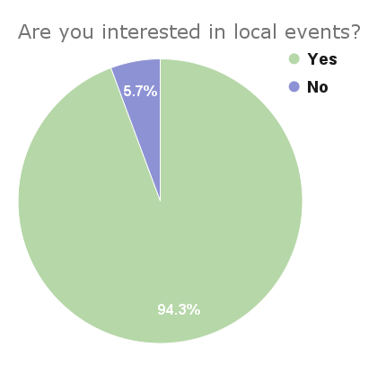
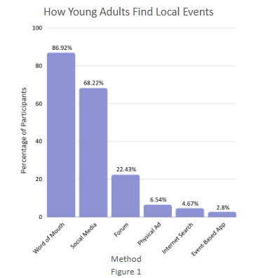
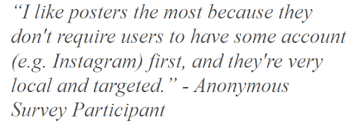
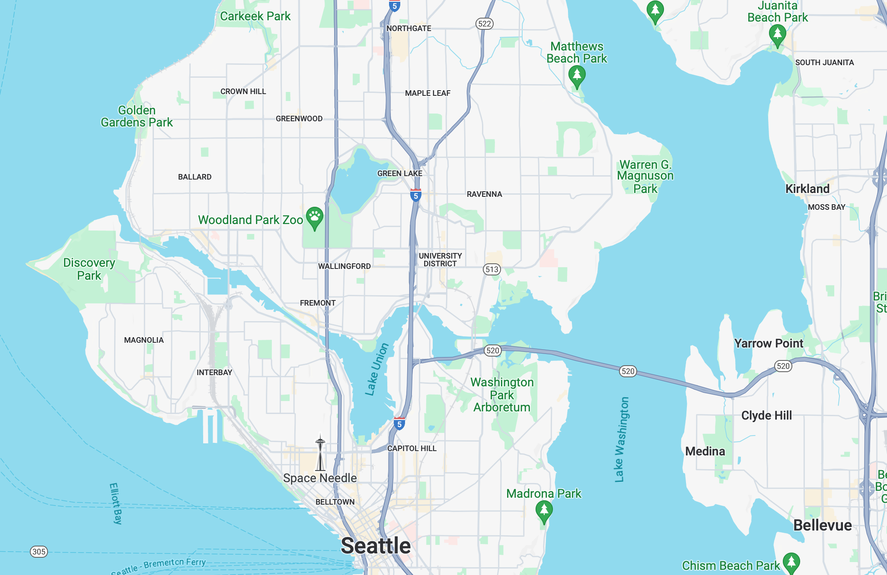
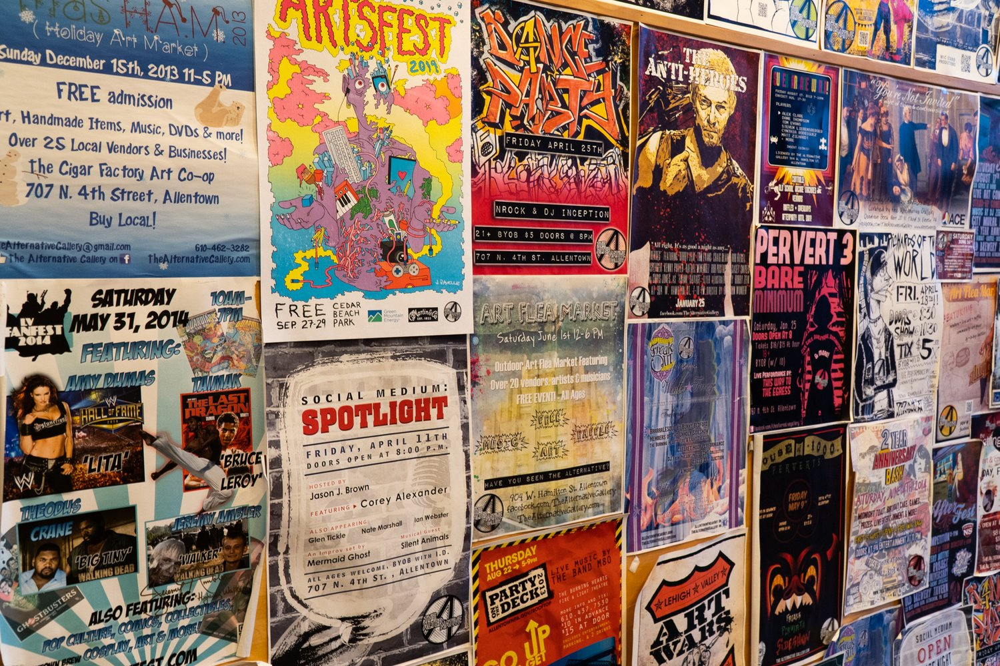

# User Research Report
## Summary
The internet facilitates communication, but online communities are often toxic and isolating. Our project leverages technology to connect young adults with local events, promoting easy communication and community connections in real life. We emphasize small-scale, community-centered events.

Our target audience is young adults (ages 18-30), because this group is likely to have the interest, flexibility, and free time to attend events and form relationships. We hope our project can serve users with a wide variety of interests and experiences but a common goal of connecting with their communities or trying new things.

## Methodology
To understand general interest in a solution, common workarounds, and pain points of existing methods of finding local events we leverage a survey. This method of research allowed us to gather a large amount of high level information in the limited time available.

## Survey Results and Discussion (AEIOU format)
*Participants*

We surveyed 107 people ages 18-30, leveraging our networks, posting on Reddit, and our UW community; 24% of our participants were 18-20, 67% were 21-25, and 9% were 26-30. Of our participants, 56% are students, 9% work part-time, 33% work part time, 1% are self-employed, and 1% are unemployed. Our participants ranged in location, with 38% of participants living in Seattle, 26% of participants from other areas of Washington, and the rest from the USA, France, and Romania.

*Activities*

We find that 94.4% of survey participants are interested in a diverse set of local events, such as: comedy shows, concerts, sports events, hobby-based events, markets, and more. Figure 1 illustrates the ways that our survey participants find local events, highlighting that a majority of participants learn about events via word of mouth and browsing social media. A non-negligible amount of participants browse forums. A minority of participants rely on physical ads, internet search, and event-based apps (such as EventBrite). Largely, our participants find events through methods of social sharing.

We also investigated the set of actions that a subset of our survey participants (those who host public events) take to publicize their own events. Of our users, 13.1%  plan community events. All of these participants use social media to spread the word, 64.3% use flyers, and 14.3%  use forums. It is interesting to note that there is a discrepancy between how event holders advertise events (most utilize flyers), and how event seekers look for events.

*Environment*

As described, our participants mainly explore events in a digital environment. Others learn of events by word of mouth which may occur digitally or in a physical space. Participants also specify learning about events in a physical space through physical ads like flyers.
Our participants actually attend events in their local community. This community is variable across participants, since they came from a variety of differently sized and located cities, but 75.7% of participants answered “no” or “sometimes” to the question of if they feel connected to their local community. Thus, these physical local environments where participants currently look to attend events is not a space they yet feel closely engaged with.

*Interaction*

Participants noted challenges they face in participating in events, in other words, challenges which inhibit interaction with their community. 61.3% of participants cited the challenge of having time to attend, and 48.1% cited finding people to go with. 69.8% of participants noted the challenge of finding events themselves and 22.6% noted finding event details, meaning interacting with their typical methods, online sources or physical ads, are not effective. Event organizers noted that social media is a challenging tool because it requires that potential attendees have an account and requires lots of interaction to actually reach people.  
Once an event is found, most participants noted they would invite a close friend (88.7%) or a friend they think would be interested (83%),  and would do so through a text (92.5%) or a social media message (64.5%). For event organizers, of course, they want to spread the word to the local public usually through social media and flyers.

*Objects*

When finding things to do in the area, the majority of participants indicated that they use a form of technology, like a phone or laptop. Outside of technology, participants use physical flyers/posters, newspapers, and posters. On the other hand, nearly all participants indicate that they use word of mouth to find things to do in the area. While word of mouth isn’t necessarily an object, it’s still an effective tool that allows the users to succeed in their environment.
For event creators, the objects they prefer to use aligns for the most part with the participants who’re event finders. The majority of event creators use social media as a means of advertising their event while around half of the event creators use physical flyers to promote their event.

*Users*

The users are young adults who’re trying to find a local event to participate in and the creators of the events. In the survey, 94.4% of participants were interested in finding local events, of which 100% of them described 1 or more difficulties that they experienced when trying to find an event. Survey participants who indicated that they plan events for their community were able to indicate something positive about the platform(s) they use to advertise their event 78% of the time, while 64% of participants found something negative. It’s clear that both the event-finders and event-creators would benefit from an alternate event-finding solution, especially with the clear disconnect that the users feel from their community. 

## Key Results and Takeaways
It was fun to learn about the variety of events people are interested in attending and useful to understand pain points encountered while using existing tools to find events. Participants are interested in engaging with local events but do not feel very connected with their community, meaning there is an opportunity to encourage connectivity through more efficient opportunities to do the things they enjoy. We hope to emphasize the local with a map based interface and equal visibility for events big and small.

There seems to be a mismatch between where event seekers look for events, and where event advertisers post their events; we have an opportunity to align these methods, and enhance the event finding/advertising experience. Lastly, we are motivated by responses from participants about flyers (that they are useful for promoting or finding events), that they may be a fun affordance or aesthetic to consider in our designs.

