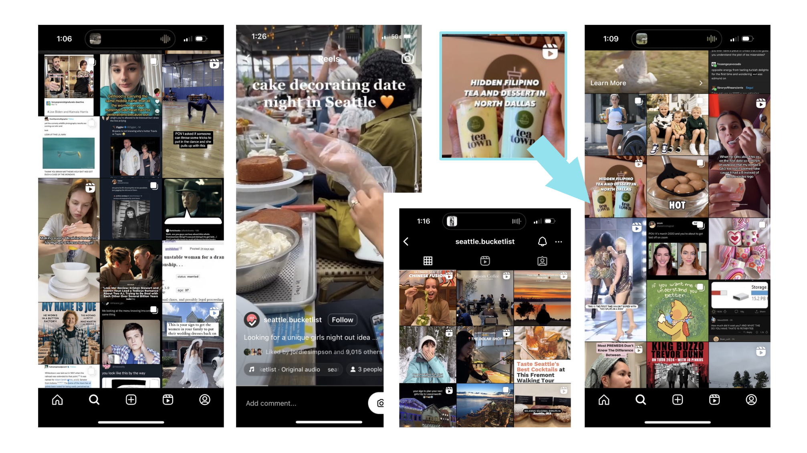
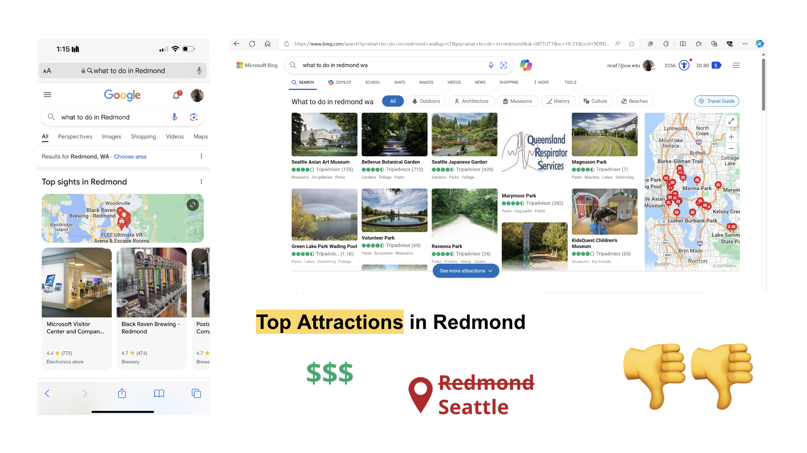
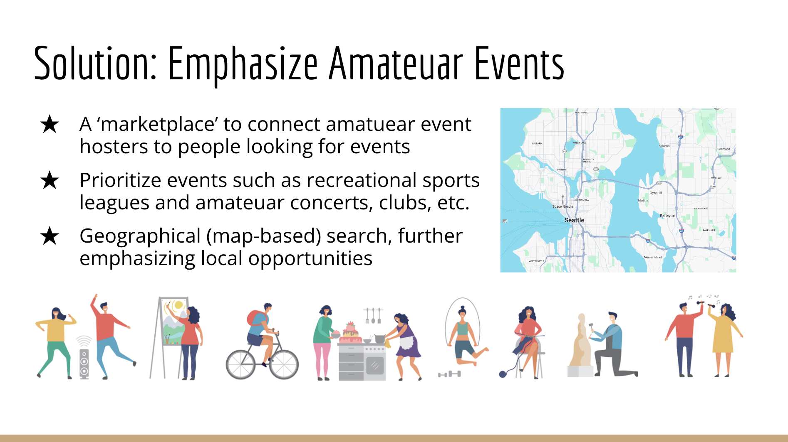
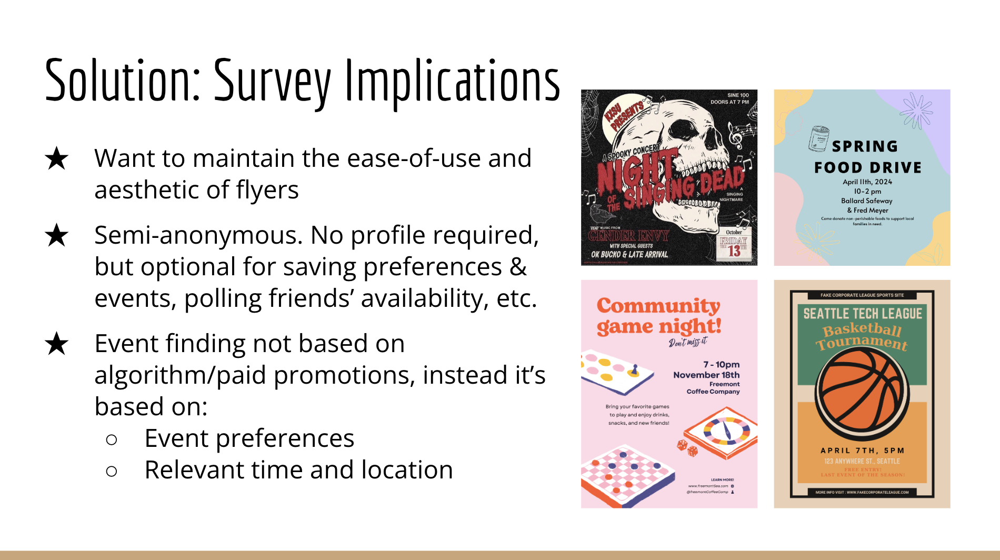

# Project Pitch Presentation

**See our initial project pitch presentation [here](https://docs.google.com/presentation/d/1ZOk7ht56aeysyVJuvruMVCC8FT6mUeCVo-j48774ou0/edit?usp=sharing)!**

*It includes a description of the problem space we intend to work within:*

    <figure style="text-align: center; margin: 10px;">
        
    </figure>

    <figure style="text-align: center; margin: 10px;">
        
    </figure>

*Our initial solution description:*

    <figure style="text-align: center; margin: 10px;">
        
    </figure>

*And how our survey results from our G1 user research report relate to the solution we've planned:*

    <figure style="text-align: center; margin: 10px;">
        
    </figure>

