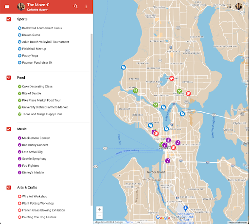
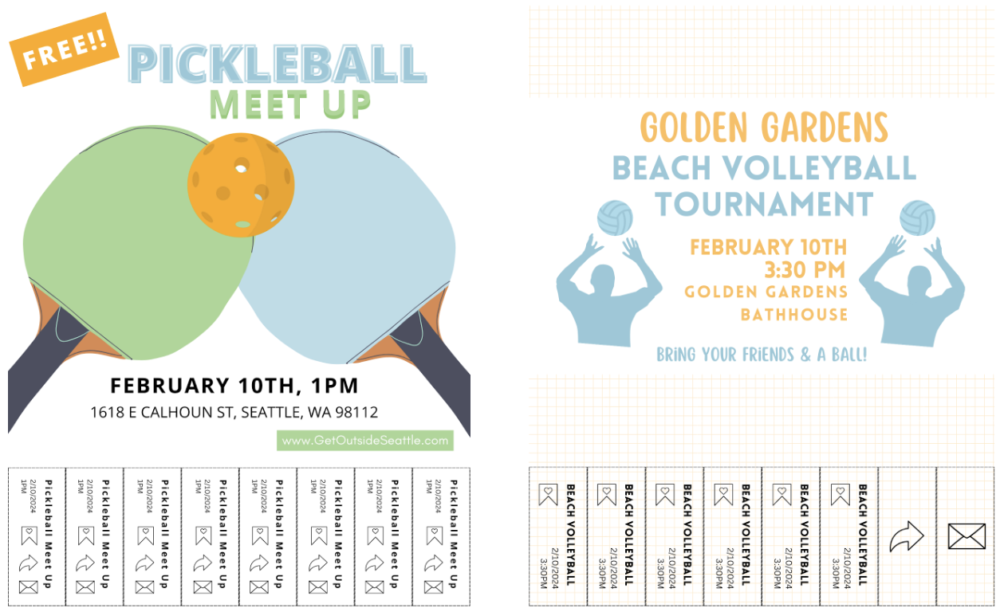
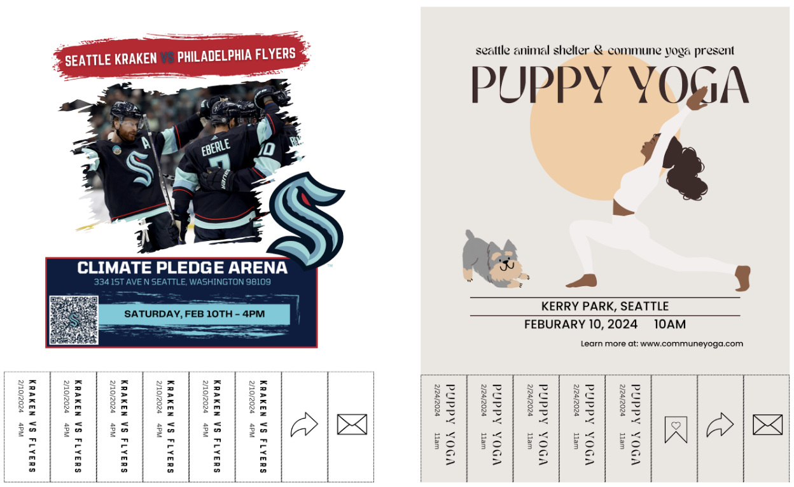
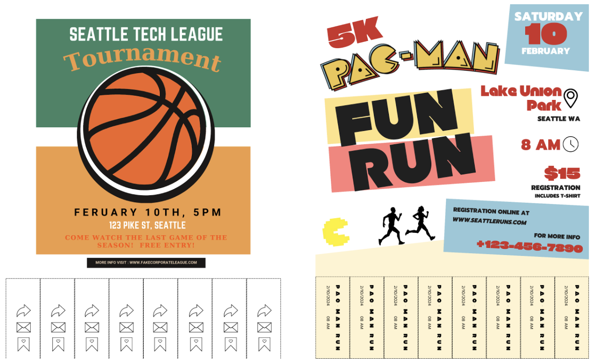
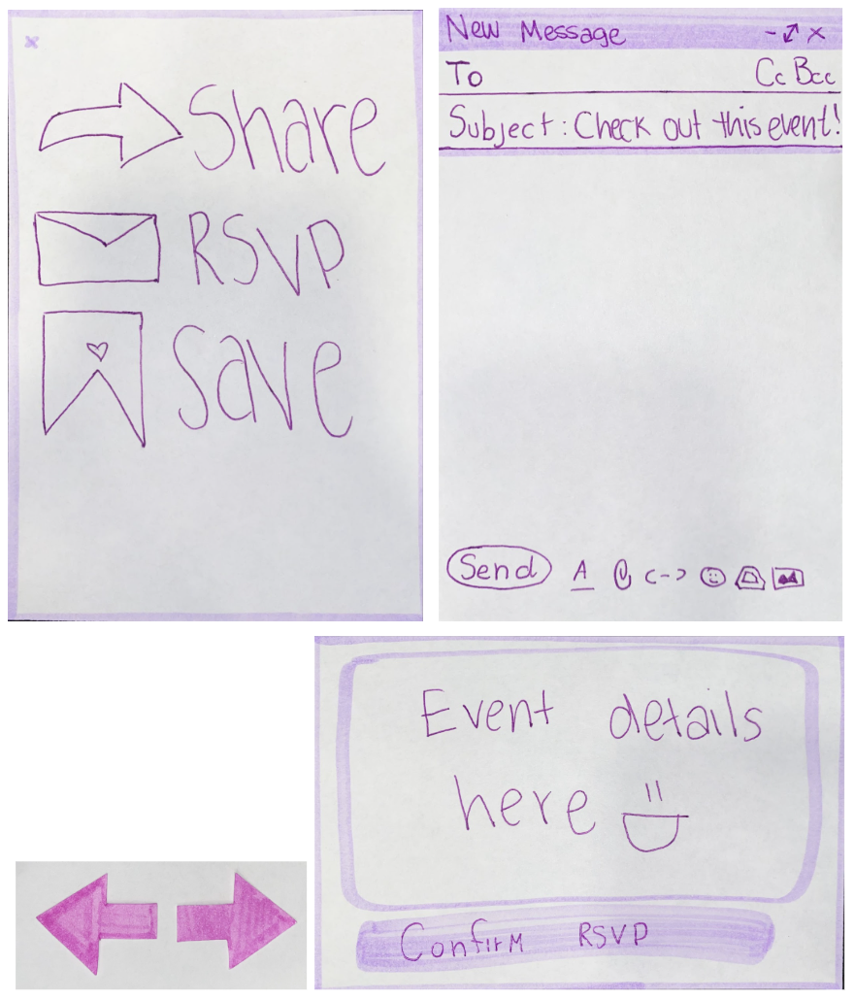
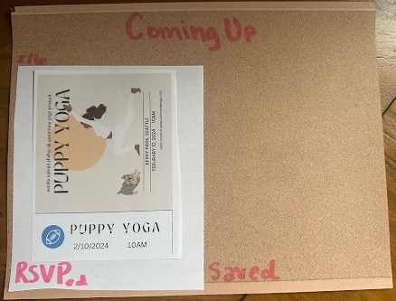
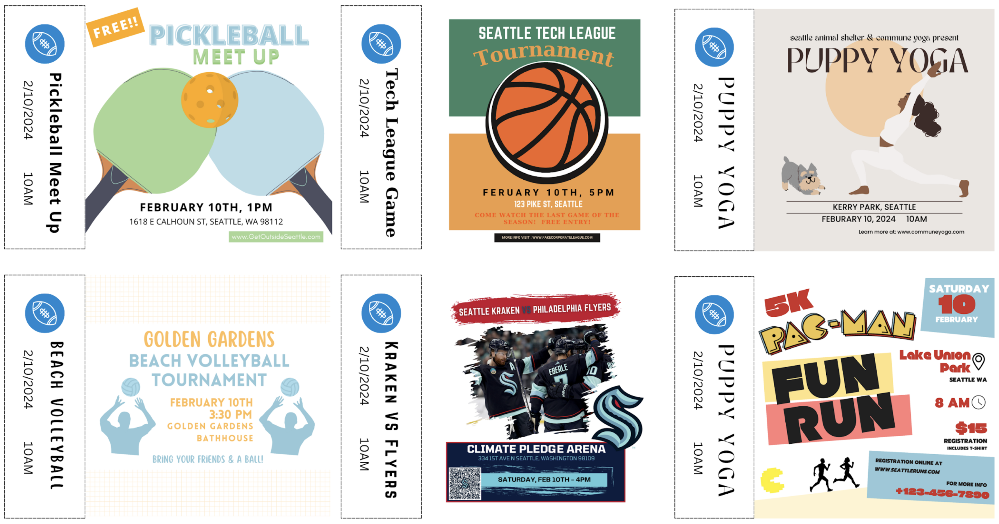

# Low Fidelity Prototype
## Prototype
*Map View of Events:* each icon corresponds to a flier and event filters are in the left bar

*Paper Flyers:* testers can browse through these and pull the paper tabs off

*Paper navigation and popup components:* arrows to "scroll" through events and pop-ups to appear on button pushes

*Saved event page components:* bulletin board style saved page and mini flyers to repressent saved events

## Report

A main priority of our app is to enable users to connect in-person at events via our platform. The specific in-person social interaction is not what our app provides, but rather an easily searchable and explorable interface where users can learn about events where they’ll find connections. So, in our prototyping, we are focusing on UI interactions and features that will make our product valuable for users in trying to find in-person social interaction opportunities.

**What were your goals with this wizard of oz session: what did you want to learn and measure?**

We wanted to learn what users thought of a map-based search, what they thought about our notion of “tearing a tab” of the poster to perform an action on the event (save, share, RSVP), and what information about events users want to know. We wanted to know how intuitive these interactions were among different UI choices and which features and information may be missing related to interacting with events and deciding to attend them.

**What did you learn in the wizard of oz session?**

We learned that users appreciated a map-based search, and were happy that there was also an option to scroll through the events that were being displayed on the map. Users informed us that they would like more filtering options, which supports our original idea, but wasn’t feasible to create in our wizard-backed-mock-up.

Users informed us that they wanted more information about event size, number of people that have RSVPed, price, and other more detailed information. Users suggested the ability to expose more information in the poster view, once they decided they were interested in the event.

Lastly, we learned that users like the idea of being able to save, share, and RSVP to events, and found the flier and especially the “saving to a bulletin board” aesthetic fun. Users also wanted the ability to create calendar events to save to their calendars or share or full integration with their personal calendars. For the tabs, users preferred that each tab:
- have consistent tab content with appearance similar to an actual tab on a paper poster (differing from one of our prototypes which had the repeated action icons on every tab), 
- or have a different action on each tab (almost representing a button),
- or just have buttons instead of tabs. 

**Are the findings promising enough that you would like to go ahead with the project? (If yes, describe why, if no, describe what changes you are proposing to make.)**

Yes. Participants liked the general premise and actions of our project. Specifically, users liked the ability to search for events that met their needs and they liked the introduction of flyers into the virtual space.

**What elements will you keep in your next iteration of the design?**

We want to maintain the affordance of tabs, because we want to bring in the real life experience of using fliers online, as well as the saved view including images of the actual saved fliers. We also liked the map search functionality, and want to keep the ability to filter results, and swipe through events while seeing the map.

**What elements do you need to revise? Why?**

We need to revise how we plan to communicate actions via tabs. Users found it confusing when multiple actions were on the same tab, and that tab was repeated for all tabs. Users liked it when a single action was on a single tab, but did not like when the rest of the tabs had other information on it as it clouded their judgment on what actions were possible (they didn’t know if they could click the non-action buttons). We will have to rethink how to communicate this information, while balancing our desire to keep the affordance of the tabs.

Users also wanted actions to be more seamless with less layers of redirection and confirmation to complete actions. We'll want to consider this in how we display actions through tabs and evaluate where to prioritize quick actions and where it is less important since a more thoughtful process is necessary for the action.