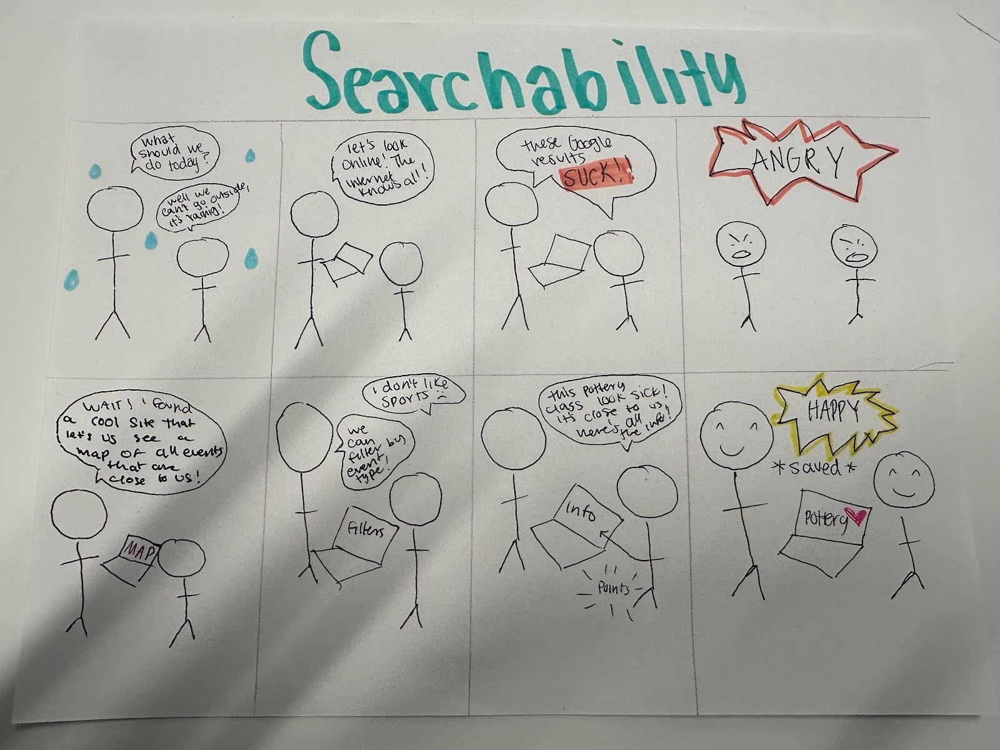
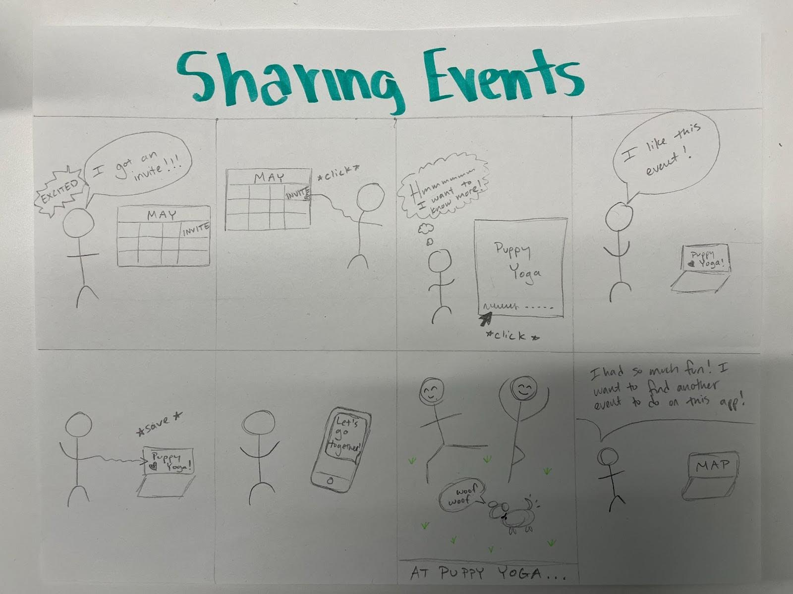
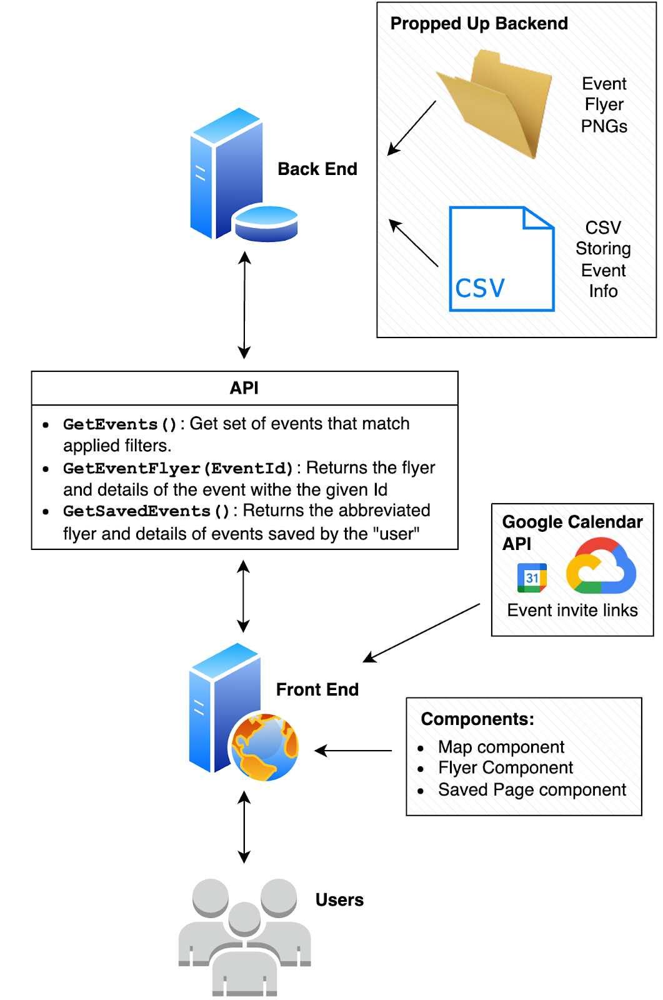

# Code and Design Specification

## Requirements
**Functional Requirements:**
- Users will be able to see a map of events
- Users will be able to filter on event types and date
- Users will be able to view the event details of the events they see on the map
- Users will be able to save events in the website
- Users will be able to save events to their Google calendar and share the calendar invite with others.

**Technical:**
- Create a map view that can be interacted with (zooming, scrolling/moving around)
- Create an event filter/search bar that is connected to the map view
- Implement event markers/pins for the map
- Implement the reflection of event filters onto events that are shown on the map
- Implement the connection of event markers to their poster view
- Implement the poster view: poster itself, more information, save event, and google calendar invite
- Implement the saved event page

**Usability:**
- Map navigation will be intuitive, in-line with map interactions of existing apps
- Buttons to prompt functionalities will have an intuitive purpose
- Design will use intuitive colors and affordances (e.g. familiar icons)

## Reach Goals:
**Functional:**
- Users can apply additional filters on search (event size, price, etc.)
- Users will be able to scroll (left to right) through events
- Map will center at the user’s location, to show events that are close to them.

**Technical:**
- Create additional filters that are connected to the map view. This includes extending our ‘database’ schema, and enabling extra filters in search results.
- Implement buttons on poster view which allow passing to the next event. 
- Implement prompts for users on available functionality (animation, hover, highlight) 
- Extend the fetching of a poster to fetch multiple, so they can be navigated seamlessly. 
- Fetch user’s location. 
- Enable the centering of the map based on the user’s fetched location.

**Usability:**
- Poster browsing, navigating between events and identifying functions, will be intuitive
- Map filtering, getting event details, and browsing events will have minimal loading time
- The design will be aesthetically pleasing, while maintaining readability and affordances that allow easy navigation.

## Storyboard
Storyboards show people learning about events through the app and enjoying the experience:

    <figure style="text-align: center; margin: 10px;">
        
    </figure>

*(Functionalities: searching and filtering, and displaying event details)*

    <figure style="text-align: center; margin: 10px;">
        
    </figure>

## Architectural Design

    <figure style="text-align: center; margin: 10px;">
        
    </figure>

The backend of our system will store the event flyer images in a folder and CSVs with event text details and other site configurations (like user’s “saved” events). It will support an API to give the frontend access to these details. 

Event details will include the name, time, date, location, additional info like cost and description, their category identifier, and a uniqueID for each.

The API will consist of endpoints to get events given applied filters (which requires searching our events CSV in the backend by those parameters), to get an event flyer (which will send the flyer png that corresponds to the id given), and to get saved events (which requires searching the saved events CSV).

The front end will access our backend’s API as well as the Google Calendar API to create invite links to events which will allow users to save events to their own calendars and share with friends.

The front end will display events on a map component which will show the locations of events with pins and allow for filtering and searching on event attributes (such as category and date). If event pins are selected, a flyer component will appear which accesses and opens the flyer png for that event. Events can be “saved,” so there will also be a saved page component where all saved flyers will be displayed. Smaller UI sub-components will also be created such as filtering and searching components for the map, “saving,” “sharing,” and arrow buttons for the flyer component.

To reach our secondary goals, additional UI sub-components will need to be created, the API will need additional endpoints, the backend will need to store a few more event details, and the API will need to be optimized.

## Enablement

Our system enables our functional requirements, which is demonstrated in our requirements text and storyboard. We allow users to find events in our map view using a map-based search (that is aided by filters) as our primary method of enabling users to find events. Our stretch goal will be to allow an alternate search view that displays events as a list, instead of on a map. We enable users to save events within our app and share them via a Google Calendar. 

Our system enables our functional requirements through its design: users interfacing with a front-end server that uses an API to talk to the backend, which hosts the ‘database’ of events and their corresponding posters. This enables the searching of events in the map view, and our stretch list view. The backend also enables the connection to Google Calendar for sharing of events as well as the functionality of saving events. We further enable our requirements because the front end will be able to display the information for users intuitively, as described in our usability goals. 