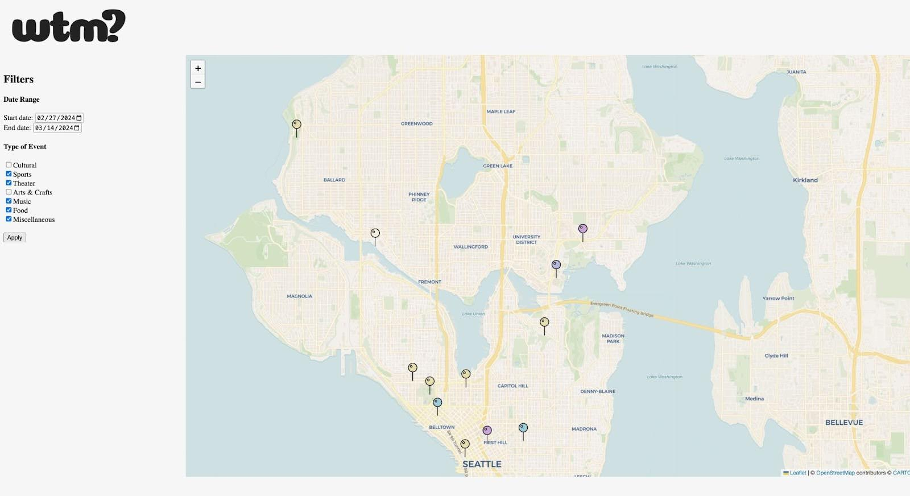
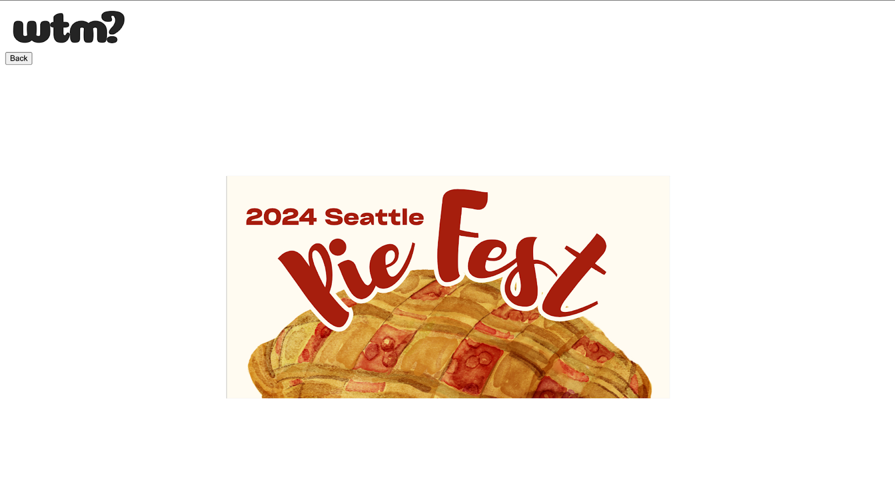

# User Testing

## Part A: Description of Medium Fidelity Prototype

**The two functionalities we implemented are:**
- Viewing events on a map (+ partial event filtering)
- Viewing event flyer.
**The code for this functionality is in our github repository The associated issues can be found in the following milestones:**
- “Initial Back-End” and “Initial Front-End”.
**Other functionalities were omitted for this milestone.**

## Part B: Screenshot/Photo of Prototype
**Map view - initial screen (+ filters which update event pins that appear):**

**Flyer view - on click of corresponding pin (needing css help):**

## Part C: User Study Results
**What did you learn in the user testing sessions?**

We learned about the following user wants for each currently implemented feature:

*Map view:*
- Users like having the map as the initial view.
- Users wanted the map to be more obviously centered at their location. Currently, the map is set to center on our classroom, however, it is not zoomed in enough to convey this to the user. 
- Users wanted to reset the map to center at their current location, and to center at inputted locations. 
- Users wanted to be able to set a max distance from their current location for events to appear.

*Filtering:*
- Users liked being able to filter and suggested many additional options they’d like to filter by, including price, size, accessibility, allergies, “vibes”/occasion, and more event types (nature, gaming)
- Users wanted a legend/color-matching for event type so they could understand what each pin represented when multiple type filters were selected.
- Users wanted filters to be applied automatically (rather than on click of “Apply” button), and users wanted the filters to persist after viewing a flyer and returning to map view.
- Users wanted select/deselect all options for event type filters.

*Flyer view:*
- Users like the aesthetics of the flyer. 
- Users wanted flyer information also presented next to it, well-formed (i.e wanted to view the poster as an image, not the only source of information). One user brought up the concern of needing alt text for flyer images.
- Users want to be able to view events in the map and as a list at the same time.

**Are the findings promising enough that you would like to go ahead with the current functionality of the prototype?**

Yes, our findings are promising enough to continue our current core functionality: 
- Much of the feedback we received we already intended to implement (most of the map and filtering related feedback in particular).
- We have planned to redesign the placement of our functionalities by including flyers adjacent to the map view (rather than a separate page) so users can see the pins and flyers at the same time. This means our sub-functionality of browsing through flyers with arrow keys is lost, but we think it is a preferred tradeoff.

**What are the next functionalities that you will implement in your prototype?**
- We will modify our UI design to support the new, adjacent map-flyer layout.
- We will style the filtering and viewing of posters.
- We will implement the saved events page and the button to save in the flyer view.
- We will implement adding events to Google calendar and the button to add in the flyer view.

The first two steps are iterations on our existing implementation based on the feedback, the last two are the functionalities we did not include for this medium fidelity prototype. Additionally, we will continue creating and finding event content to prop up the event-host side of our platform.
