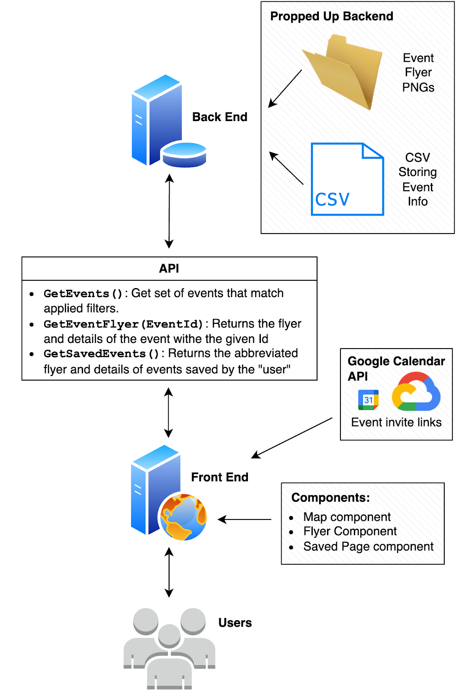

# Digital Prototype

## Final prototype overveiw

“What’s the Move?” addresses the problems that young adults in the Seattle region face with using traditional social media platforms to find local, amateur events. Often, finding events on social media is ineffective, as the algorithm is not tailored for finding things to do. For example, a user may find a post advertising an event that has already occurred, or an event that is not geographically near them. On the flip-side, event promoters struggle to find the right audience for events on traditional social media platforms that favor virality over bringing people together. 

“What’s the Move?” encourages participation in small, local events. Our final prototype is a map-based search for events which allows users to look through events based on what is near them. They can additionally filter by the dates they are available, the price point, and the type of event. This enables users to find events in their area that fit their desires. Additionally, users can learn more about events by clicking on pins (event icons) on the map. This will bring up the event flyer, along with details of the event such as the time, location, date, price, and a long-form description of the event. From there, users can save the event, and add the event to their calendar using a Google Calendar integration.

“What’s the Move?” not only brings event promoters and attendees together, it also helps people connect through local events. 

“What’s the Move?” is a web app that was architected using a front-end and back-end server.

    <figure style="text-align: center; margin: 10px;">
        
    </figure>

The frontend renders the main page, a map view with event browsing and filtering, along with the saved events page. It is a react app that interfaces with our backend server and the Google API. It treats the backend as an API, loading event details to render on the map and caching saved events to be displayed in the saved view. The frontend allows the user to log in to their google account and add events to their personal calendar via the application’s integration with the Google Calendar API.
Upon navigating to the application for the first time, the user will notice that all events displayed on the map are for that day, any cost, and any event type. For ease of view, the frontend features a home page with a collapsible filter panel with the aforementioned default settings. The events on the map update dynamically, upon any change to any of the filters. When a pin (event) on the map is selected, a third collapsable panel on the main view is opened, displaying the event flyer. The event flyer panel not only has the flyer itself, but also the event details as well as the functionality to allow the user to save their event in app as well as save the event to their google calendar. When the user navigates to the saved events view, all the events that they saved via the event flyer panel, are displayed.

The backend, or server, manages the events. Events are stored in a csv, and associated data (images) are stored in a directory. The selection of events is propped up: we manually created event flyers, details, and descriptions to populate the ‘database’. The backend reads from the propped-up ‘database’, managing the search, filtering, and saving of events through the Wander API. The Wander API includes the following functionality: getting events by filters, getting the associated flyer for an event, saving events, and getting the list of saved events.

Based on findings from our medium-fidelity prototype, the design of our application was drastically changed to better present information to the users. In the feedback we received, we learned that users wanted key information and a long form description of the event displayed in addition to the basic information already presented on the flyer. We included this feedback in our final prototype, which introduced a time-constraint, as we had to make a major pivot in our original application design.

    <figure style="text-align: center; margin: 10px;">
        
    </figure>

Above is an image of the flyer panel in the map view in our final prototype, which was created as a result of the medium-fidelity prototype’s feedback. Note that the event information is not only on the flyer, but key details as well as a long-form description of the event appears at the bottom of the panel!
All in all, we were able to achieve a high fidelity prototype to help people answer the question, “What’s the move?”. What’s your next move? Check out the [“What’s the move?  prototype](https://github.com/UWSocialComputing/wander-code/) for yourself!

## Final Prototype Images

    <figure style="text-align: center; margin: 10px;">
        
    </figure>

    <figure style="text-align: center; margin: 10px;">
        
    </figure>

    <figure style="text-align: center; margin: 10px;">
        
    </figure>

    <figure style="text-align: center; margin: 10px;">
        
    </figure>

