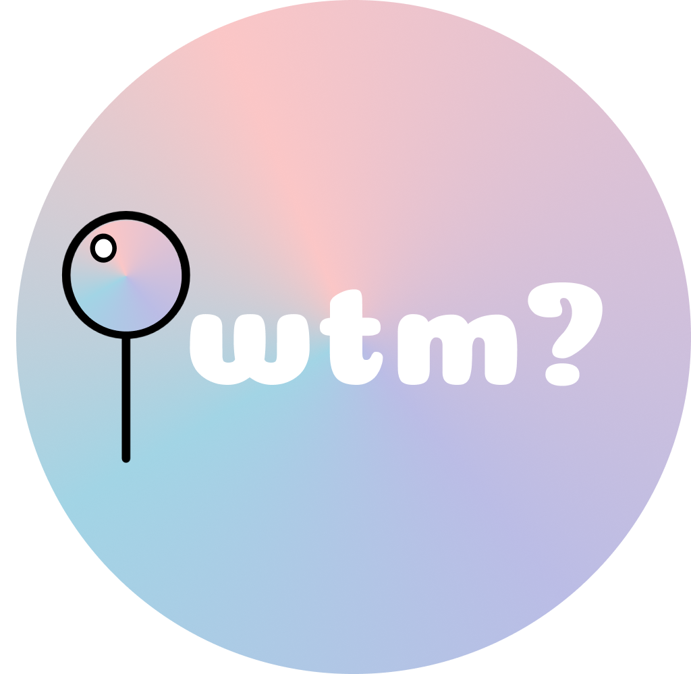
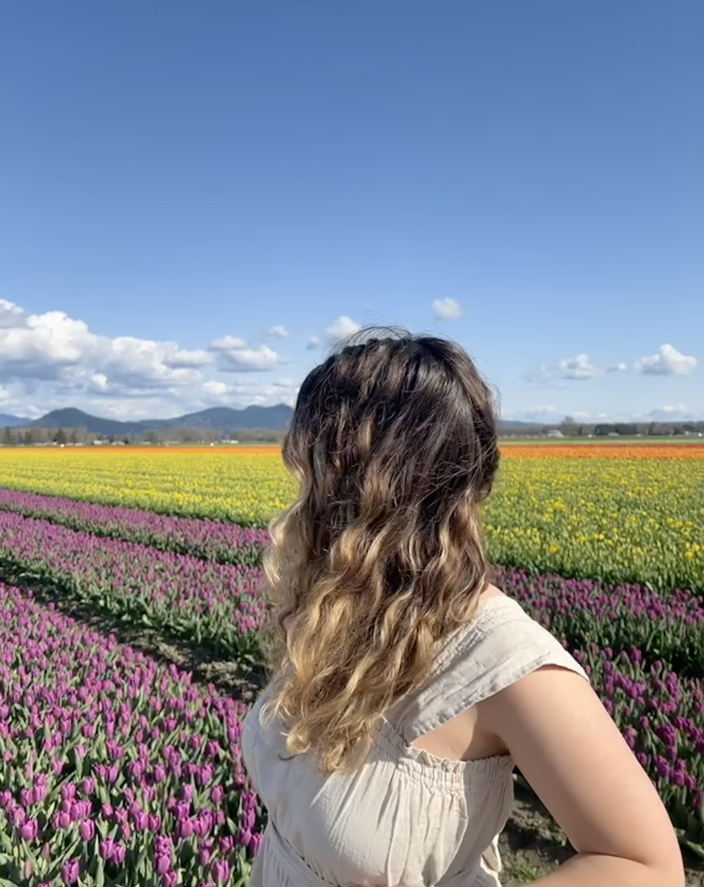

## About What's the Move?
We created What's the Move? with the goal of helping people connect through small-scale, in-person events.
With a map-based search of local events, it is easier then ever to find something fun to do!

## Meet the Team!

    <figure style="text-align: center; margin: 10px;">
        
        <figcaption><a href="https://www.linkedin.com/in/noaferman">Noa Ferman</a></figcaption>
    </figure>
    <figure style="text-align: center; margin: 10px;">
        
        <figcaption><a href="https://www.linkedin.com/in/jaela-field/">Jaela Field</a></figcaption>
    </figure>
    <figure style="text-align: center; margin: 10px;">
        
        <figcaption><a href="https://www.linkedin.com/in/katherine2001/">Katherine Murphy</a></figcaption>
    </figure>

# Blog Posts

## [User Research Report](/G1.md)

## [Pitch Presentation](/G2.md)

## [Low Fidelity Prototype](/G3.md)

## [Code and Design Specification](/G4.md)

## [Midterm Presentation](/G5.md)

## [User Testing](/G6.md)

## [Digital Prototype](/G7.md)

## [Video Demo](/G8.md)