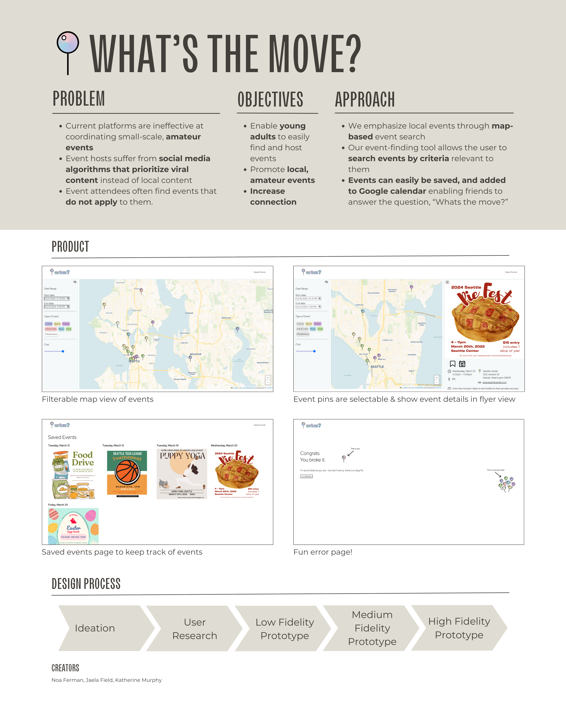

    <h1 id="intro"> Introducing... </h1>
    <figure style="margin: 10px;">
        
    </figure>

    The app making it easier than ever to decide <strong><em>what's the move?</em></strong>

    <figure style="text-align: center; margin: 10px;">
        
    </figure>

## Meet the Team!

    <figure style="text-align: center; margin: 10px;">
        
        <figcaption><a href="https://www.linkedin.com/in/noaferman">Noa Ferman</a></figcaption>
    </figure>
    <figure style="text-align: center; margin: 10px;">
        
        <figcaption><a href="https://www.linkedin.com/in/jaela-field/">Jaela Field</a></figcaption>
    </figure>
    <figure style="text-align: center; margin: 10px;">
        
        <figcaption><a href="https://www.linkedin.com/in/katherine2001/">Katherine Murphy</a></figcaption>
    </figure>

# Posts

### [User Research Report](/G1.md)

### [Pitch Presentation](/G2.md)

### [Low Fidelity Prototype](/G3.md)

### [Code and Design Specification](/G4.md)

### [Midterm Presentation](/G5.md)

### [User Testing](/G6.md)

### [Digital Prototype](/G7.md)

### [Video Demo](/G8.md)